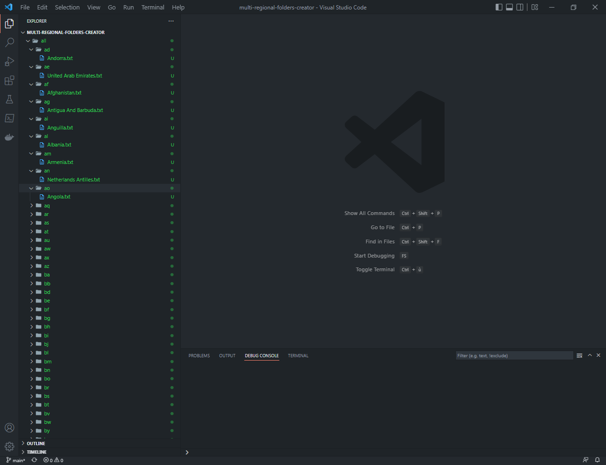

# Multi-Regional Folders Creator

Automates the creation of country folders named using their ISO alpha-2 code. Inside each folder, it creates a text file named after the country.




## Installation

1. Clone the repository or download it:

   ```shell
   git clone https://github.com/ximilsoft/multi-regional-folders-creator
   ```

2. Navigate to the project directory:

   ```shell
   cd multi-regional-folders-creator
   ```

3. run in your terminal **`python main.py`**.

## Getting Help

If you have any questions or need assistance, feel free to [open an issue](https://github.com/ximilsoft/multi-regional-folders-creator/issues) on GitHub.

## Support

If you find this project helpful, show your support by starring the repository.